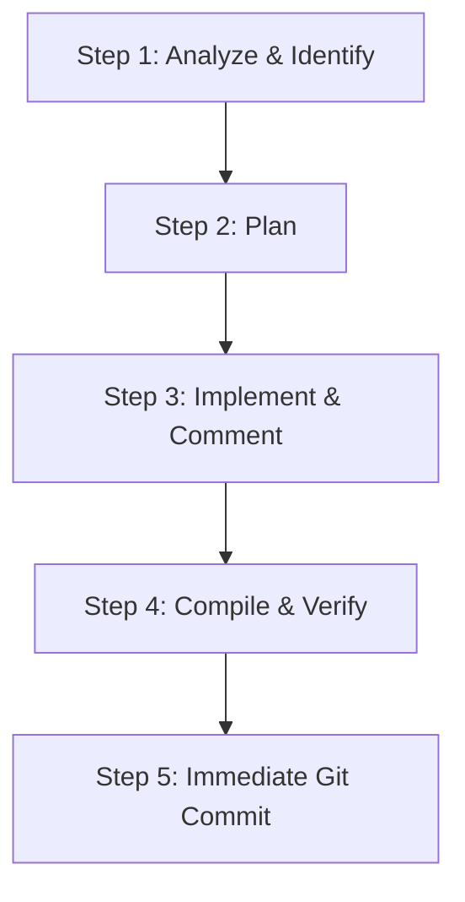

# Agent AI Developer Workflow — CardioGuard AI Issue Resolution

This workflow is specifically designed for the AI Agent (and other developers) to systematically address the issues identified in the [CODE_REVIEW.md](.docs/CODE_REVIEW.md) report, in compliance with the repository rules defined in [AGENTS.md](.docs/AGENTS.md).

---

## 🔄 Standard Issue-Fix Cycle

Every time an issue or a group of related issues from [CODE_REVIEW.md](.docs/CODE_REVIEW.md) is addressed, the developer must strictly follow this 5-step lifecycle:

### 📋 Detailed Steps:

#### 🔍 Step 1: Analyze & Identify
* **Action**: Locate the exact file and lines reported in the issue description. Read the source code in that specific file to understand its context.
* **Goal**: Identify the root cause of the bug (e.g. rate limit issues, race conditions, CORS configs, UI stretching, compile-time errors in Flutter).

#### 🗺️ Step 2: Plan
* **Action**: Design the optimal fix without disrupting the core functionalities of the project (e.g. realtime telemetry, authentication, role-based routing, ECG rendering, and 3D heart canvas).
* **Rule**: Review existing package files (`package.json`, `pubspec.yaml`) before adding new dependencies to prevent conflicts.

#### 🛠️ Step 3: Implement & Comment
* **Action**: Apply the code changes using file-editing tools.
* **Rules**:
  * Write full implementations; do not use shorthand, placeholders, or incomplete code blocks.
  * **Code Commenting & Documentation**: Every new or modified file must include a descriptive header comment summarizing its purpose, logic flow, and system relationships.
  * **Mandatory Comment Formats**:
    * **Python (Backend)**: Use Google Style Python Docstrings for all functions, routers, and classes (detailing `Args`, `Returns`, and `Raises`).
    * **TypeScript/React (Frontend)**: Use JSDoc/TSDoc format for functions and components to show hover tooltips.
    * **Dart/Flutter (Mobile)**: Use triple-slash (`///`) document comments above classes and methods to enable DartDoc rendering.

#### 🧪 Step 4: Compile & Verify
* **Action**: Execute compile and check commands based on the modified module:
  * **Backend**: Run Python linters or start FastAPI service to test API endpoints.
  * **Web Frontend**: Run `npm run build` or verify TypeScript compilation.
  * **Mobile App**: Run `flutter analyze` or compile the app to ensure no compiler warnings/errors.
* **Goal**: Ensure the issue is fully resolved and no regressions are introduced.

#### 💾 Step 5: Immediate Git Commit
* **Action**: Stage and commit the changes immediately after verification.
  * *Example*: `fix(backend): resolve rate limiting in-memory multi-worker issue [BE-01]`
* **Rule**: Never conclude a response or session with unstaged or uncommitted changes in the git workspace.

---

## ⚡ Project-Specific Guardrails
1. **Vietnamese Language Policy**: Always communicate with the user in Vietnamese.
2. **Preserve Telemetry & Custom Visuals**: Do not modify realtime telemetry flow or y-axis scales of custom visual painters (ECG, 3D Heart) for aesthetic reasons, unless explicitly requested.
3. **Execution Priority**: Resolve issues by severity order: **CRITICAL** first, followed by **HIGH**, **MEDIUM**, and **LOW**.
