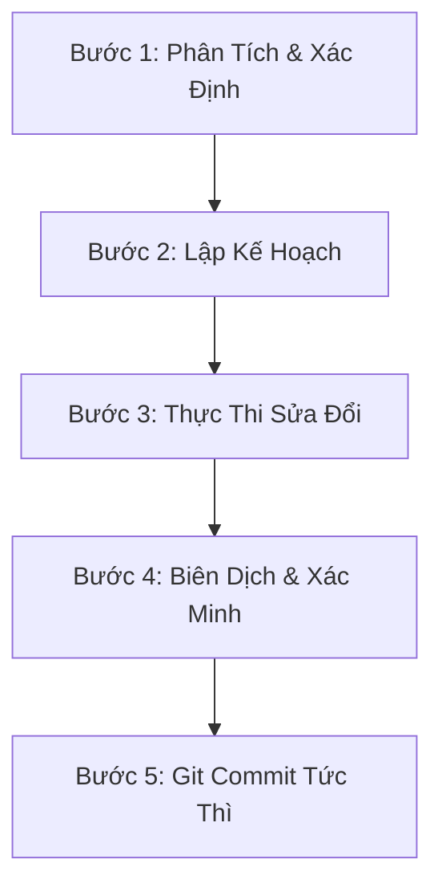

# Quy Trình Làm Việc (Workflow) Của Agent AI — Sửa Lỗi Dự Án CardioGuard AI

Quy trình này được thiết kế riêng cho tôi (Agent AI) dựa trên các cuộc hội thoại trước đó và quy tắc tại [AGENTS.md](file:///e:/AIoT/cardioguard-ai/AGENTS.md) nhằm giải quyết hơn 80 vấn đề trong báo cáo [CODE_REVIEW.md](file:///e:/AIoT/cardioguard-ai/CODE_REVIEW.md).

---

## 🔄 Lớp Vòng Lặp Sửa Lỗi Tiêu Chuẩn (Standard Issue-Fix Cycle)

Mỗi khi giải quyết một hoặc một nhóm issue từ [CODE_REVIEW.md](file:///e:/AIoT/cardioguard-ai/CODE_REVIEW.md), tôi sẽ tuân thủ nghiêm ngặt 5 bước dưới đây:

### 📋 Chi tiết các bước:

#### 🔍 Bước 1: Phân Tích & Xác Định
* **Hành động**: Tìm đến đúng file và dòng code được báo cáo trong `CODE_REVIEW.md`. Đọc trực tiếp nội dung xung quanh bằng công cụ xem file.
* **Mục tiêu**: Xác định chính xác nguyên nhân gây ra lỗi (ví dụ: lỗi bảo mật CORS, race condition TOCTOU, hay lỗi biên dịch Flutter).

#### 🗺️ Bước 2: Lập Kế Hoạch (Planning)
* **Hành động**: Đưa ra giải pháp sửa đổi tối ưu nhất mà không làm ảnh hưởng đến các thành phần cốt lõi (như telemetry thời gian thực, cơ chế xác thực, vẽ ECG và biểu đồ tim 3D).
* **Quy tắc**: Phải kiểm tra các tệp cấu hình thư viện (`package.json`, `pubspec.yaml`) trước khi quyết định thêm thư viện mới.

#### 🛠️ Bước 3: Thực Thi Sửa Đổi (Implementation)
* **Hành động**: Tiến hành áp dụng thay đổi vào mã nguồn sử dụng công cụ thay thế nội dung file.
* **Quy tắc**:
  * Tuân thủ quy tắc xuất mã nguồn đầy đủ, không viết code tắt hoặc để lại các đoạn mã giả (placeholder) không hoạt động.
  * **Chính sách chú thích mã nguồn (Code Commenting Policy)**: Mỗi tệp tin được tạo mới hoặc sửa đổi phải có phần chú thích chi tiết ở đầu file (File Header) giải thích tác dụng của file đó và vai trò của nó. Đồng thời, các hàm, lớp, khối logic phức tạp phải có comment giải thích chi tiết tác dụng, luồng hoạt động (workflow) và mục đích để làm gì.
  * **Quy chuẩn định dạng bắt buộc**:
    * **Python (Backend)**: Sử dụng *Google Style Python Docstrings* (ghi rõ các tham số `Args`, giá trị trả về `Returns`, và các ngoại lệ có thể xảy ra `Raises`).
    * **TypeScript/React (Frontend)**: Sử dụng định dạng *JSDoc/TSDoc* để hiển thị ghi chú trực quan khi rê chuột.
    * **Dart/Flutter (Mobile)**: Sử dụng chú thích tài liệu ba dấu xuyệt (`///`) để phục vụ render tài liệu qua DartDoc.
    * **Cấu trúc File Header**: Bắt đầu tệp bằng phần ghi chú gồm: (1) Mục đích tệp tin, (2) Luồng xử lý tổng thể, (3) Mối liên hệ với các thành phần khác.

#### 🧪 Bước 4: Biên Dịch & Xác Minh (Verification)
* **Hành động**: Chạy các lệnh kiểm tra lỗi cú pháp, biên dịch thử dự án tùy theo module đang sửa:
  * **Backend**: Chạy linter hoặc khởi động thử FastAPI service.
  * **Web Frontend**: Chạy `npm run build` hoặc kiểm tra lỗi TypeScript.
  * **Mobile App**: Thực hiện chạy thử `flutter analyze` hoặc biên dịch thử.
* **Mục tiêu**: Đảm bảo lỗi đã được giải quyết triệt để và không tạo ra lỗi mới làm hỏng dự án.

#### 💾 Bước 5: Git Commit Tức Thì (Commit & Clean)
* **Hành động**: Commit ngay lập tức các thay đổi lên Git với thông điệp rõ ràng, tuân thủ chính sách Git trong `AGENTS.md`.
  * *Ví dụ*: `fix(backend): giải quyết lỗi rate limit in-memory trong multi-worker [BE-01]`
* **Quy tắc**: **Không bao giờ** kết thúc lượt hội thoại mà vẫn còn file chưa được add hoặc commit trong Workspace.

---

## ⚡ Các Quy Tắc Đặc Thù Của Dự Án Cần Lưu Ý
1. **Luôn sử dụng Tiếng Việt** trong giao tiếp với người dùng.
2. **Không tự ý thay đổi** luồng hoạt động của telemetry và giao diện biểu đồ y khoa trừ khi có yêu cầu cụ thể từ người dùng.
3. **Độ ưu tiên xử lý**: Tập trung sửa các lỗi **CRITICAL** trước, sau đó tới **HIGH**, **MEDIUM**, và **LOW**.
